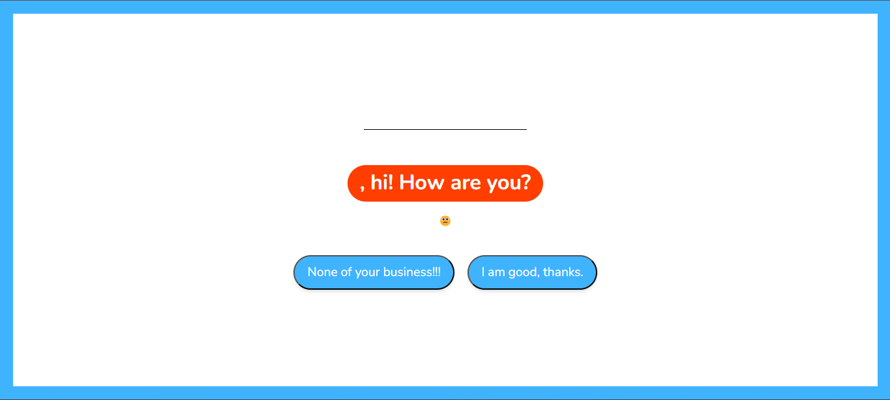
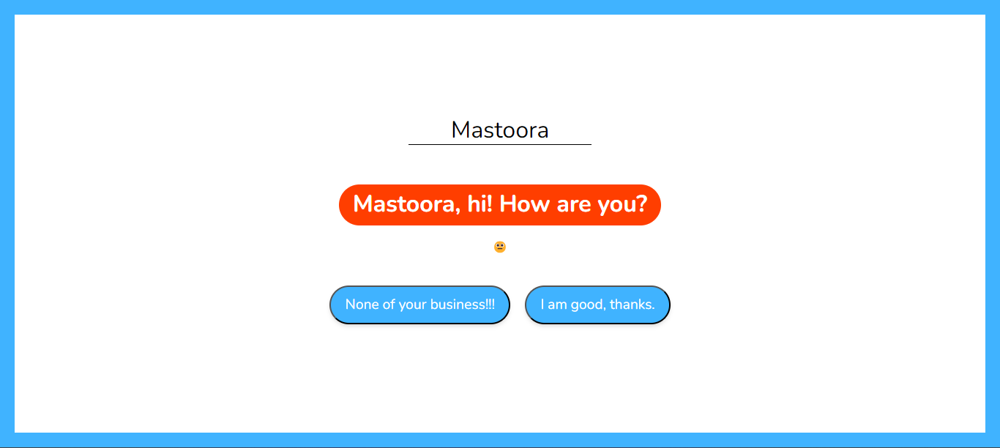
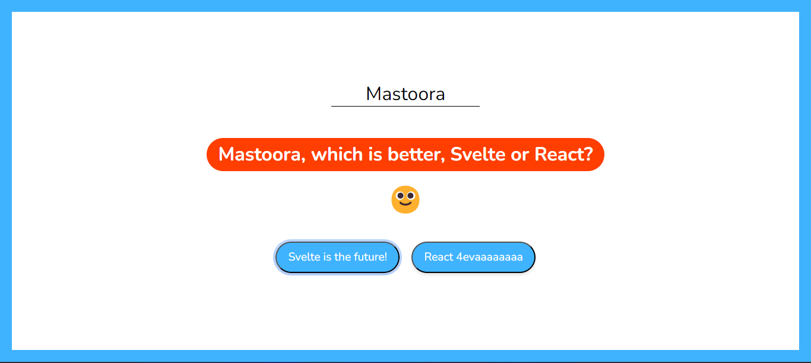
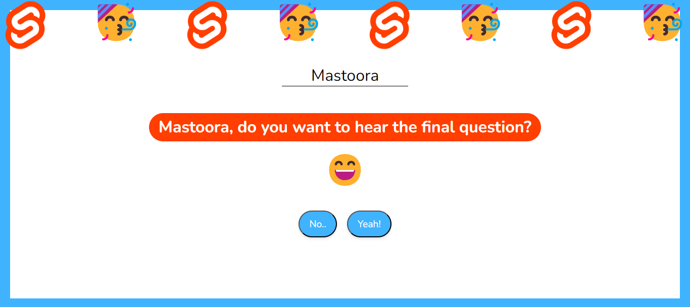
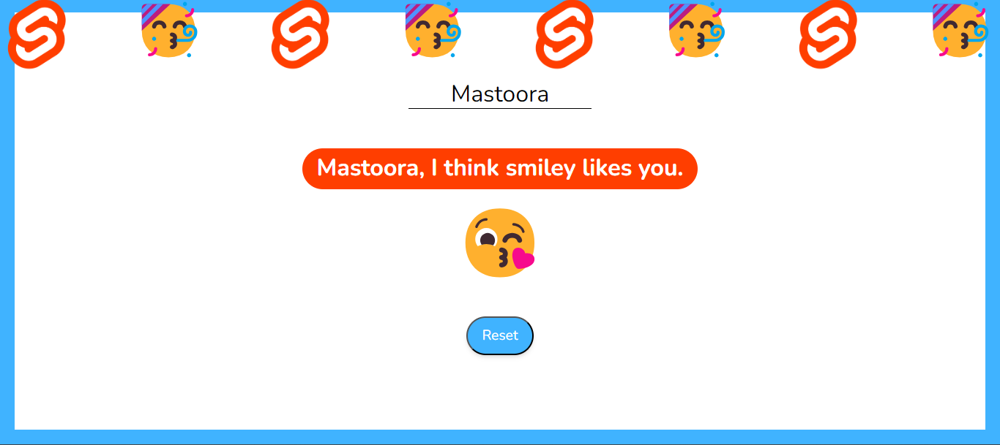
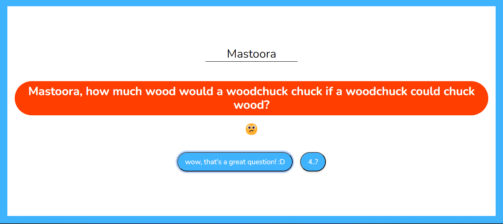
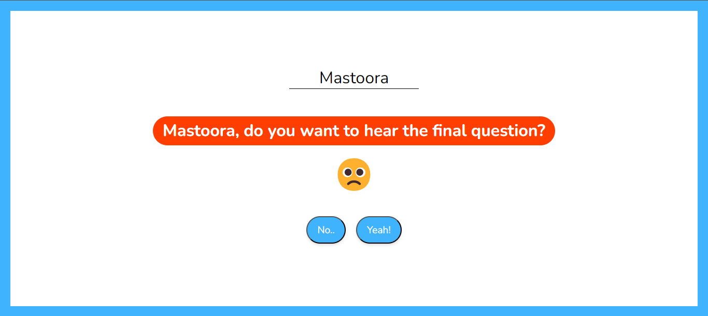
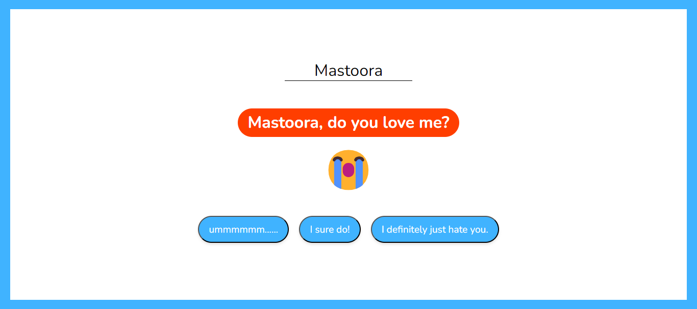
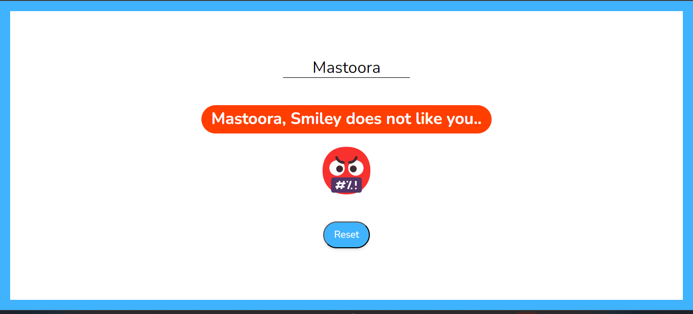

# Svelte Project

## Getting started with _npm_

```
npm create svelte@latest my-app
cd my-app
npm install
npm run dev

```

## Getting started with _pnpm_

```
pnpm create svelte my-app
cd my-app
pnpm install
pnpm run dev

```

## Install

```
# npm i svelte
# pnpm i svelte

```

Quick start:

```
$ yarn # npm install
$ yarn build # npm run build
```

## Development

Run Webpack in watch mode to continually compile the JavaScript as you work:

```
$ yarn watch # npm run watch
```

# About My Project

> To start the app, write your name blank :)
> Select one option to show the next result =)





## Positive Answers

> If you click positive answers, you can see the following results emojis reaction 🙂, 😀, 😄, 😊, 😘:









## Negative Answers

> If you click negative answers, you can see the following results and emojis reaction 😐, 😕, 🙁, 😭, 😡, 🤬:









