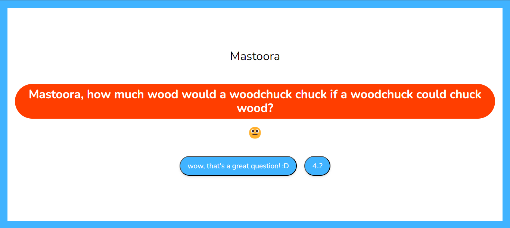
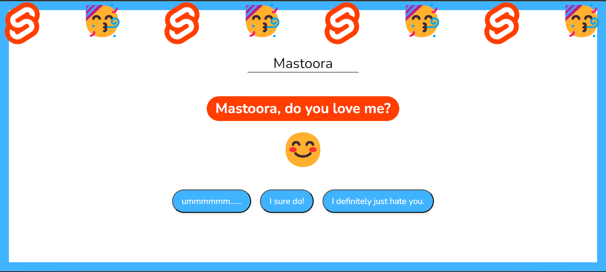

# Svelte Prject

## Getting started with _npm_

```
npm create svelte@latest my-app
cd my-app
npm install
npm run dev

```

## Getting started with _pnpm_

```
pnpm create svelte my-app
cd my-app
pnpm install
pnpm run dev

```

## Install

```
# npm i svelte
# pnpm i svelte

```

Quick start:

```
$ yarn # npm install
$ yarn build # npm run build
```

## Development

Run Webpack in watch-mode to continually compile the JavaScript as you work:

```
$ yarn watch # npm run watch
```

# About My Project

> To start app, write your name on blank :)
> Select one option to show next result =)


## Positive Answers

> If you click positives answers, you can see following results:







